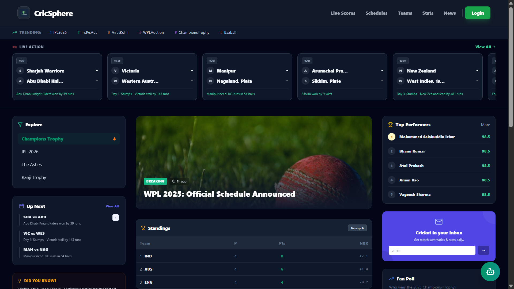
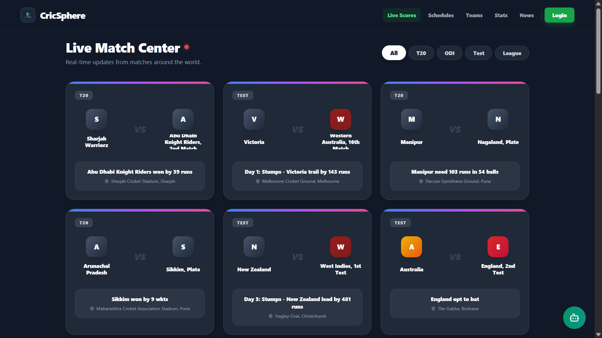
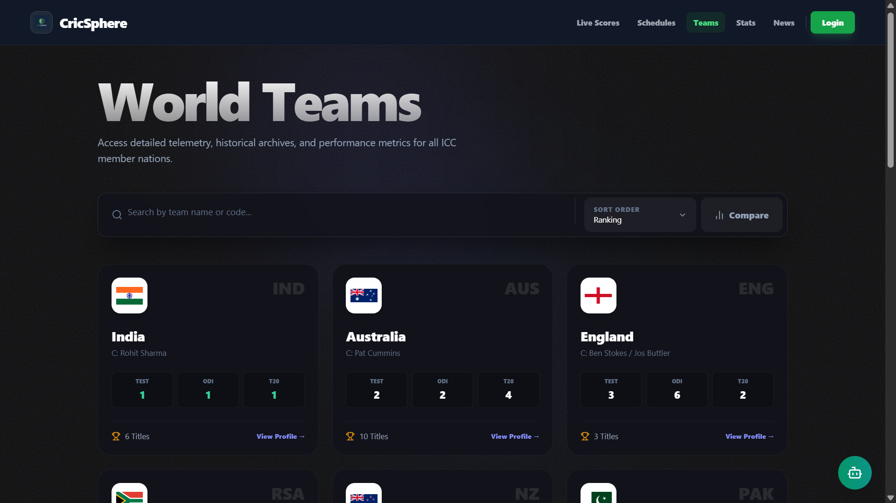
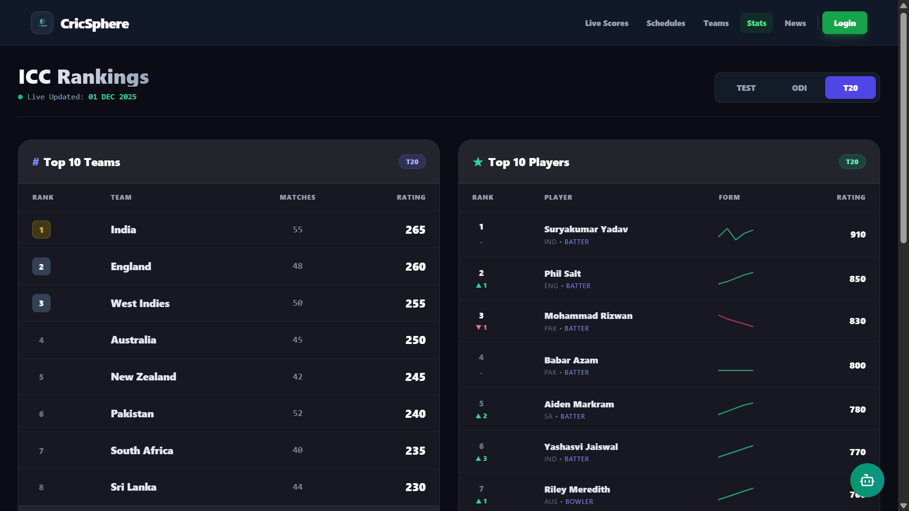
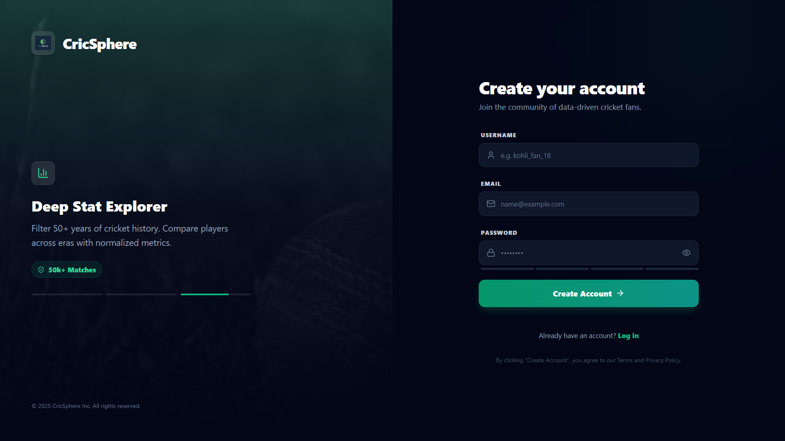

# 🏏 CricSphere – The Ultimate Cricket Destination

**CricSphere** is a modern, full-stack cricket analytics and information platform built to deliver a smooth, real-time experience for cricket fans.  
It provides **live scores**, **match schedules**, **team & player analytics**, **ICC rankings**, and a custom **Match Impact Score (MIS)** model — inside a fast, responsive Single Page Application (SPA).

> ⚠️ **Project Notice**  
> This project is protected under a **restricted license**.  
> Unauthorized copying, redistribution, or commercial usage is **strictly prohibited**.

---

## 🚀 Key Features

- 🏏 **Live Score Dashboard**  
  Real-time match tracking with clean UI and match insights.

- 📅 **Complete Cricket Ecosystem**  
  Upcoming series, tours, schedules, teams, and player information.

- 📊 **Advanced Analytics**  
  Custom **Match Impact Score (MIS)** model with performance indicators.

- 🔐 **Secure Authentication**  
  Stateless JWT-based login system with Spring Security.

- 🎨 **Modern UI / UX**  
  Responsive design, dark mode support, smooth animations, and toast notifications.

---

## 🔒 Security Architecture

CricSphere follows a **stateless, token-based authentication architecture** using **JWT**.

### Authentication Flow
1. User logs in with secure credentials  
2. Passwords are hashed using **BCrypt**  
3. Backend issues a signed **JWT** on success  
4. JWT is attached to all protected API requests  

### Authorization Model
- Role-Based Access Control (RBAC)  
- Spring Security filters for token validation  
- Protection against CSRF, token tampering, and unauthorized access  

This architecture ensures scalability, security, and session-less operation — ideal for modern SPAs.

---

## 🎨 Modern UI / UX

- **Tailwind CSS** for clean, scalable styling  
- **Framer Motion** for smooth animations and page transitions  
- Fully responsive design (mobile, tablet, desktop)  
- System-aware **Dark Mode**  
- Toast-based notifications for seamless interactions  

---

## ⚙️ Technology Stack

### 🧩 Backend
- Java 17  
- Spring Boot 3.5.6  
- Spring Security + JWT  
- Spring Data JPA  
- MySQL  
- RestTemplate (external API communication)  

### 🧩 Frontend
- React (Vite)  
- Tailwind CSS  
- React Router DOM  
- Axios  
- Framer Motion  
- React Hot Toast  

---

## 🖼️ Application Screenshots

> 📌 Place your screenshots inside a `screenshots/` folder in the root directory.

### 🏠 Home & Live Match Center

### 🌍 Teams & Rankings

### 🔐 Authentication

---

## 🛡️ Project Protection & Usage Policy

This project is intentionally protected to prevent misuse or plagiarism.

### You MAY:
- View and study the code for **educational purposes**
- Take **conceptual inspiration** with proper attribution

### You MAY NOT:
- Copy or redistribute the source code  
- Use the UI or logic for commercial purposes  
- Publish cloned or modified versions publicly  
- Claim this project as your own work  

📩 For collaboration, academic submissions, or commercial licensing, **explicit permission is required**.

---

## 📄 License

### CricSphere – Restricted Educational License

Copyright © 2025  
**Bharathula Venkata Vaibhav Ram**

This project, **CricSphere**, is protected under a **Restricted Educational License**.

Permission is granted to **view, study, and reference** this project **solely for educational and learning purposes**.

### ✅ You ARE allowed to:
- Explore the codebase for academic understanding  
- Learn from the architecture, design patterns, and workflows  
- Reference concepts with proper attribution  

### ❌ You are NOT allowed to:
- Copy, clone, or redistribute the source code (in part or full)  
- Use this project or its UI for commercial or production purposes  
- Publish modified or unmodified versions publicly  
- Claim this project as your own work or remove attribution  

Any unauthorized use, reproduction, or distribution may result in  
**takedown requests or legal action**.

For collaboration, academic reuse, or commercial licensing,  
**explicit written permission from the author is required**.

---

  Made with ❤️ by <strong>Bharathula Venkata Vaibhav Ram</strong>

